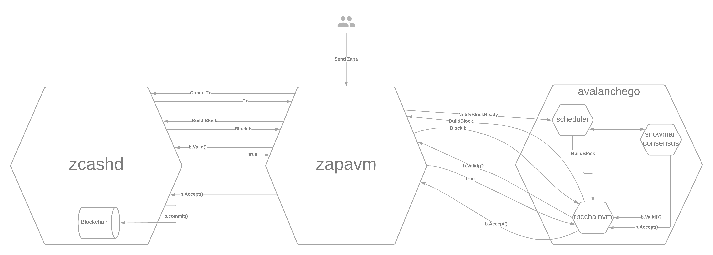

# Zapa

Zapa is **Z**ero-Knowledge **A**nonymous **P**ayments on **A**valanche -- a privacy coin built and deployed as an Avalanche Subnet. Zapa integrates the shielded payments technology of [Zcash](https://z.cash/) with the [Avalanche](https://docs.avax.network/) consensus mechanism in order to offer a lightning fast privacy coin fully operated on Proof of Stake.

## Status

- [x] Locally working end to end with [ava-sim](https://github.com/rkass/ava-sim/tree/master)
- [x] Testnet deployed
- [ ] Mainnet deployed 

## Fuji Deployment Information

Subnet ID: `2ma1j6rSYPykvTDk6JeHKGgXQzqtWbwrsEzUethnTf8k7DMSEb`

VM ID: `tGas3T58KzdjLHhBDMnH2TvrddhqTji5iZAMZ3RXs2NLpSnhH`

Active Blockchain ID: `6Jdeqk1VMB3qXhse3C3YnuoZPnaNAqGJJucyRSkXmpiekrEto`

Disabled Blockchain IDs: `ydwMTPrYBWHrGVmWfG8k4Po2eTPEqe7y7Z4jZaUr2Me6rin7`, `2LedqoeDb3zZQSqPBczemzrofepr6SzSHXxHXANrfzeFKGGNVd`

## Setup

After cloning, fetch submodules:

`git submodule update --init --recursive`

Throughout this project there are optional directives for debugging in VS Code. Contained in this repo is a pre-configured VS Code workspace. To open this project in VS Code, open VS Code and select "Open Workspace from file", then select `zapa.code-workspace` from this repo's main directory.

## Project Overview

This image depicts the three main components of Zapa and how they work together to facilitate an anonymous transaction on the blockchain. Each of those three components are also submodules of this repository:

- [avalanchego](https://github.com/ava-labs/avalanchego) -- Node implementation of the Avalanche network.
- [zapavm](https://github.com/zapalabs/zapavm) -- Go plugin which acts as a thin bridge between avalanchego and zcashd.
- [zcash](https://github.com/zapalabs/zcash) -- A daemon for generating and validating anonymous transactions.

The fourth submodule (not depicted above) is [ava-sim](https://github.com/zapalabs/ava-sim) which is a utility for spinning up a local network for testing.

## Local Setup

The best way to develop, test, and debug is to setup a local five-node network using ava-sim. The steps required are:

1. Run five versions of zcashd, each exposing a different port to talk to a unique zapavm node in the local network.
2. Run ava-sim with the zapavm plugin as an argument.
3. Interact with the local nodes to send transactions, query balances, and mine blocks.

### Step 1: Running zcashd

Follow the steps outlined in [Running zcashd: A 5 Node Local Setup](https://github.com/zapalabs/zcash/blob/master/doc/running.md#running-zcashd-a-5-node-local-setup).

### Step 2: Running ava-sim with zapavm plugin

Follow the steps linked here to [run ava-sim with the zapavm plugin](https://github.com/zapalabs/ava-sim/blob/master/README.md#running).

### Step 3: Interact with Local Nodes

See [Interacting with the Chain](https://github.com/zapalabs/ava-sim/blob/master/README.md#interacting-with-the-chain) for instructions on how to interact with the local nodes.

## Running a Validator

To validate the Zapa chain and start earning ZAPA on the fuji network:

1. Run a zcash node
2. Launch the zapavm plugin ontop of an existing avalanchego fuji deployment.

### Step 1: Run zcashd

All of these steps require checking out the [zcash](./zcash) submodule and taking action to build or run resources in that project.

- [Fetch Zcash Parameters](https://github.com/zapalabs/zcash/blob/master/doc/running.md#1-fetch-params)
- Optionally, [Build zcashd](https://github.com/zapalabs/zcash/blob/master/doc/running.md#1-build-zcashd-optional). If you don't do this step, a pre-built binary will be used.
- Follow the steps defined in [Running Zcashd as Part of your Avalanche Validator](https://github.com/zapalabs/zcash/blob/master/doc/running.md#running-zcashd-as-part-of-your-avalanche-validator)

### Step 2: Launch the zapavm plugin

- Ensure you have an `avalanchego` node pointed at the Fuji network. See [Avalanche Docs](https://docs.avax.network/build/tutorials/nodes-and-staking/set-up-node-with-installer/)
- Either follow instructions to [build zapavm](./zapavm#building) from source or use a [pre-existing build](https://github.com/zapalabs/zapavm#builds). 
- Move the plugin binary to your plugins directory, usually found at `build/plugins/` relative to your `avalanchego` program
- Update your node configuration to whitelist the subnet specified [above](#fuji-deployment-information).
- Restart `avalanchego`
- When the node has finished bootstrapping, you should see logs indicating this in the chain log. 

### Step 3: Interact with the chain

- See [Interacting with the Chain](https://github.com/zapalabs/ava-sim/blob/master/README.md#interacting-with-the-chain) for instructions on how to interact with the blockchain. 
- Copy the blockchain ID specified [above](#fuji-deployment-information). 

#### Inspiration for Interacting with the Chain

In case you're looking for inspiraton, here's a sequence of calls you can make to earn and transact ZAPA:
1. Call [MineBlock](https://github.com/zapalabs/zapavm#zapavmmineblock) to ask your node to produce a block. 
2. Call [NodeBlockCounts](https://github.com/zapalabs/zapavm/blob/main/README.md#zapavmnodeblockcounts) to verify that your node has indeed produced a block. If your node has successfully produced a block, you should also have some coinbase rewards. If not, return to step 1. Sometimes this takes a few tries. 
3. Call [ListSpent](https://github.com/zapalabs/zapavm#example-list-unspent) to see your balances. 
4. Then, try sending some funds around...privately, of course. Call [z_getnewaddress](https://github.com/zapalabs/zapavm/blob/main/README.md#example-z_getnewaddress) to get a shielded address. 
5. Then call [SubmitTx](https://github.com/zapalabs/zapavm/blob/main/README.md#zapavmsubmittx) in order to send some ZAPA from one of your unspent addresses to this new shielded address. 
6. You can then verify the coinas got there by calling [z_getbalance](https://github.com/zapalabs/zapavm/blob/main/README.md#example-z_getbalance). 
7. Once you've verified that you can shield funds, try then sending ZAPA to someone else's z-address. Any transactions between z-addresses are 100% private.
